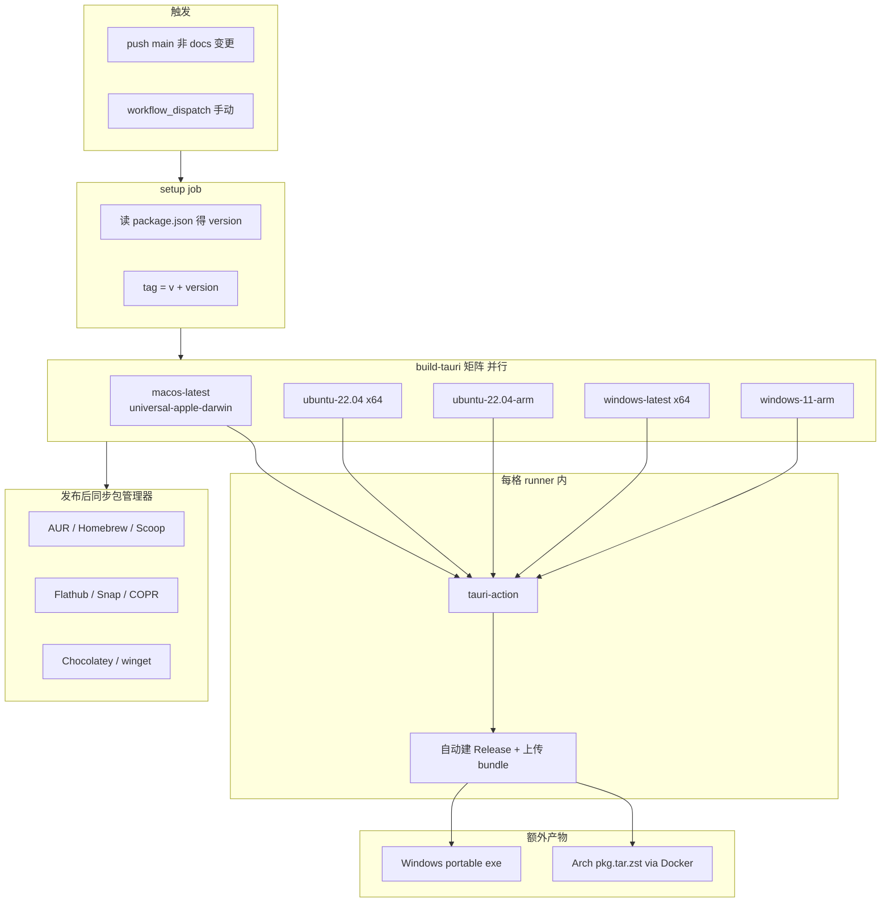

# clippy 多平台 Release 打包研究笔记

> 源码：`06_learngithub/02_clippy`（上游 0-don/clippy）  
> Fork：https://github.com/gmnoah/clippy

## 一句话结论

**核心就两步：Tauri 在 `tauri.conf.json` 里声明要出哪些安装包格式 + GitHub Actions 用 `tauri-apps/tauri-action` 在矩阵 runner 上并行 `tauri build`，自动创建 Release 并上传产物。**

多平台不是靠一套脚本交叉编译全部搞定，而是 **5 个 CI runner 各打各的平台**，Tauri 在每个平台上一次性产出该平台支持的全部格式。

---

## 架构总览



---

## 1. 打包格式的来源：`tauri.conf.json`

```json
"bundle": {
  "targets": ["app", "deb", "rpm", "dmg", "appimage", "nsis"]
}
```

| 平台 | Tauri 一次 build 产出 |
|------|----------------------|
| macOS | `.dmg`、`.app`、`.app.tar.gz`（更新用） |
| Linux x64/arm64 | `.deb`、`.rpm`、`.AppImage` |
| Windows x64/arm64 | NSIS `.exe` 安装包 |

**不用自己写 deb/rpm/nsis 脚本**——Tauri CLI 内置 bundler 会按 targets 列表生成。

macOS 用 `--target universal-apple-darwin` 打 **Universal Binary**（Intel + Apple Silicon 合一），比分别打两个 arch 少一个 runner。

---

## 2. CI 核心：`.github/workflows/release.yml`

### 触发方式（与常见 tag 发布不同）

```yaml
on:
  workflow_dispatch:      # 可手动点
  push:
    branches: [main]
    paths-ignore:
      - "docs/**"         # 只改文档不触发
```

**每次 push main（非 docs）就发版**，版本号来自 `package.json`，tag 自动拼成 `v{version}`。  
对比你本地的 `01_markamd-main`：那边是 **打 tag `v*.*.*` 才触发**，且用 draft release 防竞态。

### 矩阵并行（5 平台同时跑）

```yaml
matrix:
  include:
    - platform: "macos-latest"
      args: "--target universal-apple-darwin"
    - platform: "ubuntu-22.04"        # x64 Linux
    - platform: "ubuntu-22.04-arm"   # ARM64 Linux
    - platform: "windows-latest"     # x64
    - platform: "windows-11-arm"     # ARM64
```

`fail-fast: false`：某一平台失败不影响其他平台产物上传。

### 真正干活的 action

```yaml
- uses: tauri-apps/tauri-action@v0
  env:
    GITHUB_TOKEN: ${{ secrets.GITHUB_TOKEN }}
  with:
    tagName: ${{ env.TAG }}           # v1.6.26
    releaseName: ${{ env.TAG }}
    releaseDraft: false
    args: ${{ matrix.args }}          # macOS 传 universal target
```

`tauri-action` 内部会：`npm/yarn install` → `tauri build` → 创建/更新 GitHub Release → 上传 `src-tauri/target/release/bundle/` 下所有产物。

### 加速手段

| 手段 | 实现 |
|------|------|
| Cargo 缓存 | `actions/cache` 缓存 `~/.cargo` + `src-tauri/target` |
| 并行矩阵 | 5 个 runner 同时跑 |
| 取消旧构建 | `concurrency: cancel-in-progress: true` |
| 单 macOS universal | 少打一个 macOS job |

### 额外产物（Tauri 不自带）

- **Windows portable**：build 后手动 `cp` release 目录下的 `.exe`，用 `softprops/action-gh-release` 再传一份
- **Arch Linux `.pkg.tar.zst`**：在 ubuntu runner 里用 Docker 跑 `archlinux` + `makepkg`，模板在 `.github/aur/PKGBUILD`

---

## 3. 版本号同步：husky + sync-version.js

`package.json` 是唯一版本源。`pre-commit` 钩子跑 `sync-version.js`，同步到：

- `src-tauri/Cargo.toml`
- `src-tauri/tauri.conf.json`
- `src-tauri/Cargo.lock`
- `README.md` 下载链接
- `installer-hooks.nsh`（NSIS 多语言标题）

改版本只需改 `package.json`，提交时自动传播。

---

## 4. 包管理器自动发布（第二阶段）

`build-tauri` 完成后还有两个 job：

### `publish-linux`（ubuntu）

从刚发布的 GitHub Release 下载 deb/dmg/exe，算 SHA256，渲染模板后推送：

- AUR（`ssh://aur@aur.archlinux.org`）
- Homebrew tap（`0-don/homebrew-clippy`）
- Scoop bucket（`0-don/scoop-clippy`）
- Flathub PR（flatpak-builder-tools 生成 cargo/node sources）
- Snap（`snapcore/action-build`）
- Fedora COPR（`copr-cli build`）

模板占位符：`{{NAME}}` `{{VERSION}}` `{{SHA256}}` 等。

### `publish-windows`

- Chocolatey：`choco pack` + `choco push`
- winget：`vedantmgoyal9/winget-releaser` 自动提 PR 到 microsoft/winget-pkgs

这些步骤需要额外 secrets（`GH_PAT`、`AUR_SSH_PRIVATE_KEY`、`CHOCOLATEY_API_KEY` 等），**没有也不影响 GitHub Release 本体**。

---

## 5. v1.6.26 实际 Release 资产（13 个）

```
clippy_1.6.26_universal.dmg          # macOS
clippy_1.6.26_amd64.deb              # Linux x64
clippy_1.6.26_arm64.deb              # Linux ARM64
clippy-1.6.26-1.x86_64.rpm
clippy-1.6.26-1.aarch64.rpm
clippy_1.6.26_amd64.AppImage
clippy_1.6.26_aarch64.AppImage
clippy_1.6.26_x64-setup.exe          # Windows x64 安装包
clippy_1.6.26_arm64-setup.exe
clippy_1.6.26_x64-portable.exe       # 便携版（CI 额外上传）
clippy_1.6.26_arm64-portable.exe
clippy-rs-bin-1.6.26-1-x86_64.pkg.tar.zst  # Arch（Docker makepkg）
clippy_universal.app.tar.gz          # Tauri 更新通道
```

---

## 6. 与 markamd 方案对比（同目录 01_markamd-main）

| 维度 | clippy | markamd |
|------|--------|---------|
| 触发 | push main | push tag `v*.*.*` |
| macOS | 1 job universal | 2 job 分 aarch64/x86_64 |
| Release | 直接发布 | draft → 合并 latest.json → publish |
| 前端包管理 | bun/yarn | bun |
| 签名 | 无 Apple 签名配置 | 完整 Apple + TAURI_SIGNING |
| 包管理器 | 8 渠道自动同步 | 无 |

clippy 追求 **推送即发布 + 包管理器全覆盖**；markamd 追求 **可控 tag 发布 + 自动更新签名**。

---

## 7. 在你 Fork 上试打包

已 Fork：https://github.com/gmnoah/clippy  
本地 remote：`fork` → `https://github.com/gmnoah/clippy.git`

### 最安全：手动触发（不改 workflow）

1. 打开 https://github.com/gmnoah/clippy/actions/workflows/release.yml
2. **Run workflow** → Run workflow
3. 等 5 个矩阵 job 跑完，到 Releases 页看产物

仅需内置 `GITHUB_TOKEN`，无需配置 secrets 也能打出基础安装包。  
`publish-linux` / `publish-windows` 里推 AUR/Homebrew 等会因缺 secret 跳过或失败，但不影响主 Release。

### 若不想每次 push 都发版

可把 `on.push` 改成只保留 `workflow_dispatch`，或改成 tag 触发（参考 markamd）。

### 本地单平台验证（macOS）

```bash
cd 06_learngithub/02_clippy
npm install
npm run tauri:build
# 产物在 src-tauri/target/release/bundle/
```

### 推送到 fork 触发 CI

```bash
git push fork main
```

---

## 8. 可复用到自己 Tauri 项目的最小清单

1. `tauri.conf.json` → `bundle.targets` 列出要的格式  
2. `.github/workflows/release.yml` → matrix + `tauri-apps/tauri-action@v0`  
3. Linux runner 装 `libwebkit2gtk-4.1-dev` 等系统依赖  
4. `actions/cache` 缓存 Cargo  
5. （可选）模板 + 第二段 job 同步 Homebrew/AUR/winget  
6. 版本：单一来源 + pre-commit 同步脚本

**最快路径**：先抄 clippy 的 `build-tauri` job，删掉 `publish-linux` / `publish-windows`，只保留 GitHub Release 多平台产物。